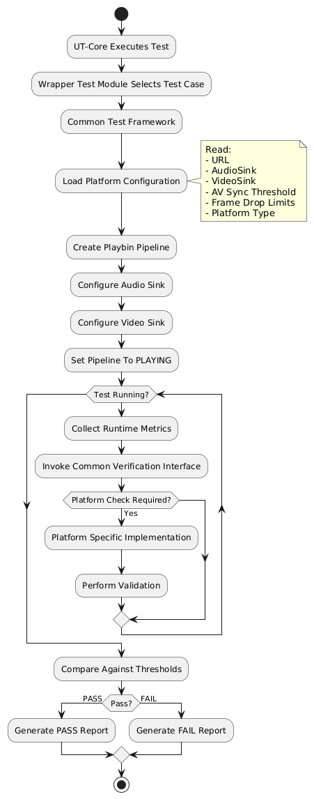
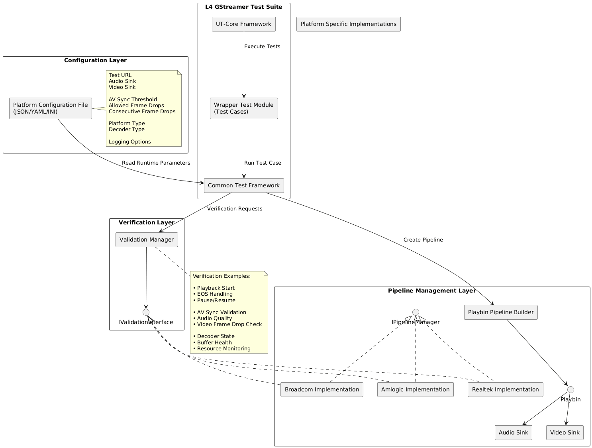

# GStreamer Pipeline Validation Framework

## 1. Overview

`L4-rdk-audio-video` is a Yocto-built RDK test package for validating GStreamer video pipelines on platform-specific devices.

The package combines:

- UT Core test registration and execution.
- UT Control logging/KVP support.
- INI-based runtime configuration.
- FFmpeg/libavformat codec detection.
- Platform-specific pipeline construction.
- GStreamer and GstValidate scenario execution.
- Timestamp anomaly detection.
- JSON runtime reports.

The current target executable is:

```text
/usr/bin/rdkgstreamerplugin/l4test/L4-rdk-audio-video
```

The design is intended to support additional test groups and platform implementations without moving common dependency or package logic into each test folder.

## 2. Design Goals

The framework is organized around these goals:

1. Keep test registration separate from pipeline construction.
2. Keep platform-specific pipeline decisions outside the common test code.
3. Load runtime paths, element names, sinks, and thresholds from `platform.ini`.
4. Detect the media codec before creating the platform pipeline.
5. Reuse the common GstValidate execution and reporting flow.
6. Allow future test folders to be added through child CMake projects.
7. Keep Yocto packaging responsible for supplying the executable, configuration, libraries, and video assets.

## 3. High-Level Architecture



## 4. End-to-End Execution Flow



## 5. Folder Structure

```text
L4-rdk-audio-video/
|-- CMakeLists.txt
|-- L4-rdk-audio-video.bb
|-- README.md
|-- config/
|   `-- platform.ini
|-- docs/
|   |-- HDL.png
|   `-- Dataflow.png
|-- rdk-audio-video-testframework/
|   |-- CMakeLists.txt
|   |-- rdk-AV-UT.cpp
|   |-- include/
|   |   |-- L4-rdk-audio-video.h
|   |   |-- l4_configuration.h
|   |   |-- pipeline_management_interface.h
|   |   |-- pipeline_management_layer.h
|   |   `-- verification_layer.h
|   |-- platforms/
|   |   |-- Amlogic/
|   |   |   `-- src/platform_pipeline_management.cpp
|   |   |-- Broadcom/
|   |   |   `-- src/platform_pipeline_management.cpp
|   |   `-- Realtek/
|   |       `-- src/platform_pipeline_management.cpp
|   `-- src/
|       |-- common_test_framework.cpp
|       |-- configuration_layer.cpp
|       |-- L4-rdk-audio-video.cpp
|       |-- pipeline_management_layer.cpp
|       `-- verification_layer.cpp
`-- video-inputs/
    |-- BigBuckBunny.mp4
    |-- ffmpeg-defective-test.mp4
    |-- negative-jump-test.ts
    |-- duplicate-timestamp-test.ts
    |-- timestamp-continuity-defective.ts
    `-- bigbuck-clean-20s.mp4
```

The parent CMake file is the common build entry point. The `rdk-audio-video-testframework` child CMake file owns the current test executable. Future test groups can be added as sibling folders and registered from the parent with `add_subdirectory(...)`.

## 6. Build Design

### 6.1 Parent CMake

The root `CMakeLists.txt` owns shared build concerns:

- CMake project and install directories.
- Threads and pkg-config discovery.
- GStreamer and GstValidate discovery.
- FFmpeg/libavformat, libavcodec, and libavutil discovery.
- CURL and libfyaml discovery.
- GoogleTest and GoogleMock discovery.
- The `ut_core` static library.
- The shared `L4-rdk-audio-video_dependencies` interface target.
- Installation of `platform.ini` and the `video-inputs/` directory.
- Registration of child test folders.

The parent receives these paths from BitBake:

```text
UT_CORE_DIR
UT_CONTROL_DIR
L4_CONFIG_INSTALL_PATH
```

### 6.2 Audio Decoder Child CMake

`rdk-audio-video-testframework/CMakeLists.txt` owns:

- Common decoder test sources.
- The selected platform source.
- The `L4-rdk-audio-video` executable.
- Test-specific include paths and compile definitions.
- Linking to `ut_core` and `L4-rdk-audio-video_dependencies`.
- Installation of the executable.

The child does not rediscover shared libraries. This keeps future child projects consistent and avoids duplicating dependency logic.

### 6.3 UT Core Source Integration

The parent builds UT sources fetched by the Yocto recipe:

```text
UT_CORE_DIR/src/cpp_source/ut_gtest.cpp
UT_CORE_DIR/src/ut_main.c
UT_CORE_DIR/src/ut_kvp_profile.c
UT_CONTROL_DIR/src/ut_log.c
UT_CONTROL_DIR/src/ut_kvp.c
```

The C/C++ language split is intentional:

- `ut_gtest.cpp`, `ut_main.c`, `ut_kvp_profile.c`, and `ut_log.c` are compiled as C++ for the GTest-based UT integration.
- `ut_kvp.c` remains C because its implementation uses C allocation semantics.

## 7. Yocto Integration

The recipe is `L4-rdk-audio-video.bb`.

### Source Inputs

The recipe fetches:

```text
https://github.com/rdkcentral/ut-core.git
https://github.com/rdkcentral/ut-control.git
```

Both use the `develop` branch and currently use `${AUTOREV}`. Pin `SRCREV_utcore` and `SRCREV_utcontrol` for reproducible release builds.

The local source directory is:

```bitbake
S = "${WORKDIR}/L4-rdk-audio-video"
```

### Build Dependencies

The recipe builds against:

- GoogleTest.
- pkg-config native support.
- CURL.
- libfyaml.
- FFmpeg.
- GStreamer 1.18.5.
- GstValidate through `gst-devtools` 1.18.5.

The FFmpeg runtime package is also included because `VideoCodecDetector` calls libavformat at runtime:

```bitbake
RDEPENDS:${PN} = " \
    ffmpeg \
    ...
"

```

### Installed Files

The package installs:

```text
/usr/bin/rdkgstreamerplugin/l4test/L4-rdk-audio-video
/etc/rdk/ut-core/platform.ini
/usr/share/rdk/L4-rdk-audio-video/video-inputs/*
```

## 8. Runtime Configuration

The default configuration is:

```text
/etc/rdk/ut-core/platform.ini
```
A custom configuration can be selected for the public scenario methods with:

```sh
export L4_CONFIG=/tmp/platform.ini
```

The parser accepts `key=value` lines and ignores blank lines, comments beginning with `#` or `;`, and section headers such as `[platform]`.

### Configuration Model

`L4Configuration` contains:

| Group | Keys |
| --- | --- |
| Platform | `platform` |
| General media | `test_url`, `pause_video`, `forward_seek_video`, `timestamp_gap_video`, `timestamp_negative_jump_video` |
| Playbin elements | `source_element`, `audio_sink`, `video_sink`, `audio_filter`, `video_filter` |
| Scenario elements | `scenario_source_element`, `mp4_demux_element`, `ts_demux_element`, `mp4_demux_link`, `ts_demux_link`, `h264_parser_element`, `video_convert_element`, `decoder_element` |
| Playback | `volume`, `mute` |
| Validation | `eos_timeout_seconds`, `allowed_frame_drops`, `av_sync_tolerance_ms` |


## 9. Build and Deployment

### Build

```sh
cd /home/naveen/Documents/yocto_build/24July_Apache4k_vendor
export PATH=/home/naveen/bin:$PATH
MACHINE=apache-4k
source scripts/setup-environment
bitbake -c compile -f lib32-L4-rdk-audio-video
bitbake -c install -f lib32-L4-rdk-audio-video
```

Build the selected image after changing the recipe, FFmpeg configuration, platform implementation, or runtime assets.

### Device Verification

```sh
ls -l /usr/bin/rdkgstreamerplugin/l4test/L4-rdk-audio-video
ls -lh /usr/share/rdk/L4-rdk-audio-video/video-inputs/
ls -l /etc/rdk/ut-core/platform.ini
```

If copying a standalone binary:

```sh
scp -P 10022 L4-rdk-audio-video root@DEVICE_IP:/tmp/
ssh -p 10022 root@DEVICE_IP
chmod +x /tmp/L4-rdk-audio-video
/tmp/L4-rdk-audio-video
```

If `/tmp` is mounted `noexec`, run the binary from an executable filesystem.

## 10. Adding a New Test Group

Create a sibling directory:

```text
pipeline_validation/
|-- CMakeLists.txt
|-- include/
`-- src/
```

Register it from the parent:

```cmake
add_subdirectory(pipeline_validation)
```

The child CMake should own its sources and executable, and link shared targets:

```cmake
target_link_libraries(new_test_target PRIVATE
    ut_core
    L4-rdk-audio-video_dependencies
)
```

Keep these concerns in the parent:

- Common dependency discovery.
- UT Core and UT Control integration.
- Shared install data.
- Shared package-level configuration.

Keep these concerns in each child:

- Test sources.
- Test-specific headers.
- Test-specific compile definitions.
- Test executable installation.
