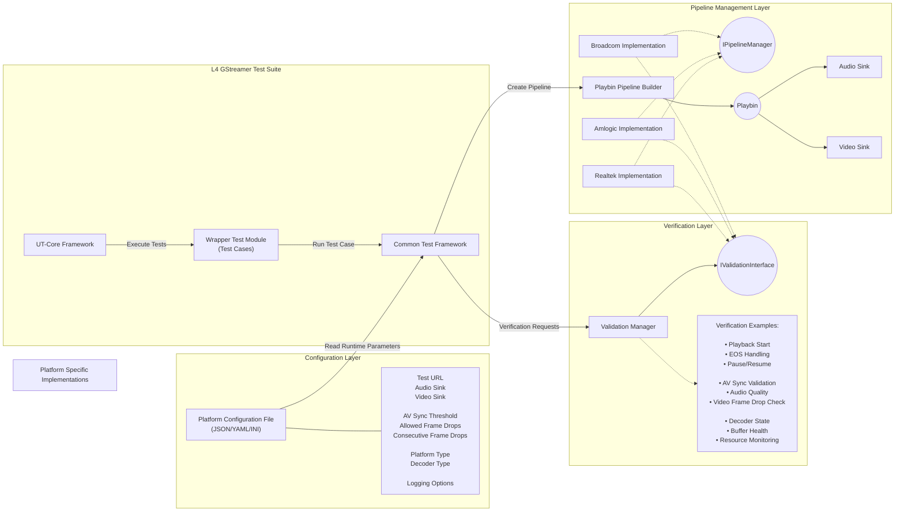

# High-Level Architecture

```mermaid
flowchart LR
    subgraph configuration_layer["Configuration Layer"]
        config_file["Platform Configuration File<br/>(JSON/YAML/INI)"]
        config_values["Test URL<br/>Audio Sink<br/>Video Sink<br/><br/>AV Sync Threshold<br/>Allowed Frame Drops<br/>Consecutive Frame Drops<br/><br/>Platform Type<br/>Decoder Type<br/><br/>Logging Options"]
        config_file --- config_values
    end

    subgraph l4_suite["L4 GStreamer Test Suite"]
        ut_core["UT-Core Framework"] -->|Execute Tests| wrapper["Wrapper Test Module<br/>(Test Cases)"]
        wrapper -->|Run Test Case| common["Common Test Framework"]
    end

    platform_header["Platform Specific Implementations"]

    subgraph verification_layer["Verification Layer"]
        validation_manager["Validation Manager"] --> validation_interface(("IValidationInterface"))
        verification_examples["Verification Examples:<br/><br/>&bull; Playback Start<br/>&bull; EOS Handling<br/>&bull; Pause/Resume<br/><br/>&bull; AV Sync Validation<br/>&bull; Audio Quality<br/>&bull; Video Frame Drop Check<br/><br/>&bull; Decoder State<br/>&bull; Buffer Health<br/>&bull; Resource Monitoring"]
        validation_manager -.-> verification_examples
    end

    subgraph pipeline_layer["Pipeline Management Layer"]
        pipeline_interface(("IPipelineManager"))
        pipeline_builder["Playbin Pipeline Builder"] --> playbin(("Playbin"))
        playbin --> audio_sink["Audio Sink"]
        playbin --> video_sink["Video Sink"]
        broadcom["Broadcom Implementation"]
        amlogic["Amlogic Implementation"]
        realtek["Realtek Implementation"]
    end

    config_file -->|Read Runtime Parameters| common
    common -->|Verification Requests| validation_manager
    common -->|Create Pipeline| pipeline_builder
    broadcom -.-> pipeline_interface
    amlogic -.-> pipeline_interface
    realtek -.-> pipeline_interface
    broadcom -.-> validation_interface
    amlogic -.-> validation_interface
    realtek -.-> validation_interface
```
